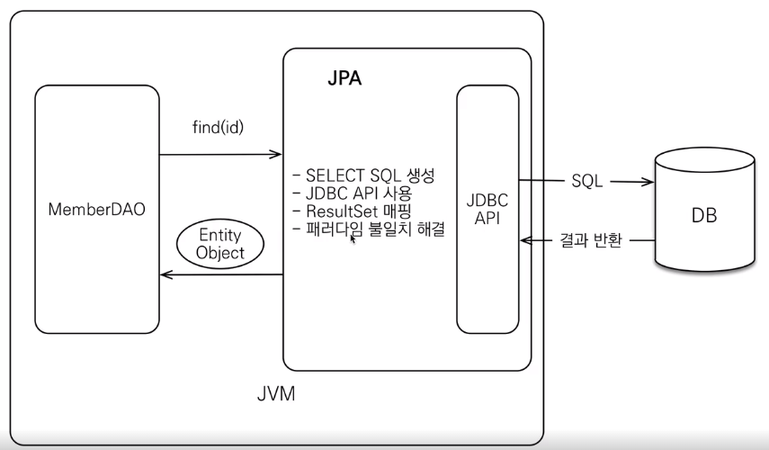
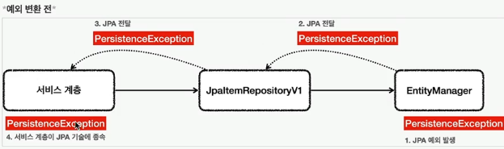
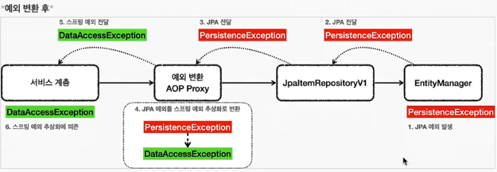

## 개요
- 학습 목표
    - 해당 기술들이 왜 필요한지
    - 각 기술의 장단점이 무엇인지
- 다양한 데이터 접근 기술 방식
    - SQLMapper : 개발자가 SQL만 작성하면 그 결과를 객체로 편리하게 매핑
        - JdbcTemplate
        - MyBatis
    - ORM 관련 기술 : 저장하고 싶은 데이터를 자바 컬렉션에 저장하고 조회하듯이 사용 가능하게 함, SQL을 만들어줌
        - JPA, Hibernate
        - 스프링 데이터 JPA
        - Querydsl
---
## Jdbc Template
- 반복작업 해결
  - 커넥션 획득
  - `statement`를 준비하고 실행
  - 결과를 반복하도록 루프를 실행
  - 커넥션/ `statement`/ `resultset` 종료
  - 트랜잭션을 다루기 위한 커넥션 동기화
  - 예외 발생 시 스프링 예외 변환기 실행
- 단점 
  - 동적 sql을 해결하기 어렵다.
  
### Build Code
```groovy
implementation 'org.springframework.boot:spring-boot-starter-jdbc'
```

### 기능
- 순서 기반 파라미터 바인딩 (defalut)
- 이름 지정 파라미터 `NamedParameterJdbcTemplate`
  - 이때까진 sql문의 ? 에 바인딩 할 때, 순서에 맞게 지정을 해주어야 했다.
  - 하지만 이런 제약은 버그를 유발할 수 있기 때문에 순서에 상관 없이 가능하게 해당 기능을 사용한다. 
  - 바인딩에 사용되는 파라미터 종류
    1. `Map`
    2. `SqlParameterSource`
       - `BeanPropertySqlParameterSource`
       - `MapSqlParameterSource`
  - `BeanPropertyRowMapper` : 언더스코어 표기법을 카멜로 자동 변환해준다.
- `SimpleJdbcInsert` : Insert SQL 편리하게 이용하게 해줌 
- `SimpleJdbcCall` : 스토어드 프로시저를 편리하게 호출 가능

### 동적 쿼리 - MyBatis 
- sql을 직접 사용할 때 동적 쿼리를 쉽게 작성할 수 있다. 

---
## 데이터베이스에 연동하는 테스트 
- `@SpringBootTest`는 `@SpringBootApplacation`을 찾아서 설정으로 사용한다.

### 테스트 원칙
- 테스트는 다른 테스트와 격리해야 한다.
- 테스트는 반복해서 실행할 수 있어야 한다.

### 데이터베이스 분리
- /test 폴더 안의 properties 파일에 db 연결 정보를 바꿔준다. 

### 데이터 롤백 
- 트랜잭션 시작 -> 테스트 실행 -> 트랜잭션 롤백 
- `@BeforeEach` , `@AfterEach` 활용
- `@Transational`을 테스트에 사용하면, 트랜잭션을 시작시킨 후 테스트 로직 수행 후, 롤백되도록 수행된다.

### 임베디드 테스트 데이터베이스
- 임베디드 DB용 트랜잭션 매니저 새로 생성하는 방법  
  - 테스트용 DriverManagerDataSource 생성
  ```java
    @Bean
    @Profile("test")
    public DataSource dataSource() {
        log.info("메모리 데이터베이스 초기화");
        DriverManagerDataSource dataSource = new DriverManagerDataSource();
        dataSource.setDriverClassName("org.h2.Driver");
        dataSource.setUrl("jdbc:h2:mem:db;DB_CLOSE_DELAY=-1");
        dataSource.setUsername("sa");
        dataSource.setPassword("");
        return dataSource;
    }
    ```
  - schema.sql : table을 생성하기 위한 파일
- 스프링 부트와 임베디드 모드 
  - 스프링 부트는 데이터베이스에 대한 별다른 설정이 없으면 임베디드 데이터베이스를 사용한다. 

---
## MyBatis
- 추후 필요하면 살펴볼것 

---
## JPA
- 동작방식
    - 
- 주요 기능
  - 캐시 기능 : 이전에 수행했던 SQL문에 대한 정보를 불러온다.
  - 트랜잭션을 지원하는 쓰기 지연 : 트랜잭션을 커밋할 때까지 insert SQL을 모은 뒤, JDBC BATCH SQL 기능을 사용해서 한번에 SQL 전송한다.
  - JPA는 즉시로딩을 지원한다.
    - 즉시 로딩 : JOIN SQL로 한번에 연관된 객체까지 미리 조회
    - 지연 로딩 : 객체가 실제 사용될 때 로딩 
### Build Code
```groovy
	implementation 'org.springframework.boot:spring-boot-starter-data-jpa'
```
```properties
#JPA log
    # 하이버네이트가 생성하고 실행하는 SQL을 확인할 수 있다.
logging.level.org.hibernate.SQL=DEBUG
    # SQL에 바인딩 되는 파라미터를 확인할 수 있다.
logging.level.org.hibernate.type.descriptor.sql.BasicBinder=TRACE

```
### 기능
- JpaBaseConfiguration.java
  - 스프링부트가 JPA 설정 시 필요한 EntityManagerFactory , JpaTransactionManager, 데이터소스 등 다양한 설정을 자동화 해줌 
- @Entity : JPA에 객체로 인식시킴 
  - public 이나 protected의 기본` `생성자 필수로 있어야 한다.
- EntityManager.persist()
  - insert문을 만들어주는 메서드 
- Update 관련 영속성 컨텍스트 
  - JPA는 트랜잭션이 커밋되는 시점에, 변경된 엔티티 객체가 있는지 확인한다.
  - 특정 엔티티 객체가 변경된 경우에는 UPDATE SQL을 실행한다.
  - 테스트의 경우 마지막에 트랜잭션이 롤백되기 때문에 (기본설정) JPA는 UPDATE SQL을 실행하지 않는다.
  - 테스트에서 UPDATE SQL을 확인하려면 update 관련 메서드에 `@Commit`을 붙여 확인할 수 있다. 
- JPQL 
  - JPA가 제공하는 객체지향 쿼리 언어
  - 주로 여러 데이터를 복잡한 조건으로 조회할 때 사용한다. 
  - SQL이 테이블을 대상으로 한다면, JPQL은 엔티티 객체를 대상으로 SQL을 실행한다고 볼 수 있다. 

### JPA 예외
- `EntityManager`은 스프링과 관련없는 JPA 기술이므로, 예외가 발생하면 JPA 관련 예외가 터진다.
  - `PersistenceException`과 그 하위 예외
  - `IllegalStateException`
  - `IllegalArgmentException`
  
- JPA 예외 변환기 `PersistenceExceptionTranslator`
  - 스프링과 JPA를 함께 사용하고 `EntityManager`를 사용하는 리포지토리단에 `@Repository`를 써주면
  - 예외 변환 AOP 적용대상이 되며 예외가 스프링 예외로 변환한다.
  
  - `EntityManagerFactoryUtils.convertJapAccessExceptionIfProssible()` : 실제 JPA 예외를 변환하는 코드 

### 동적 쿼리 - Querydsl

---
## 스프링 데이터 JPA
- 등장이유
  - 다양한 데이터베이스(저장소)들의 등장
  - 저장 하는 양식은 달라도, 결국 데이터 CRUD는 같다. 추상화하여 통합하자!
- 기능
  - CRUD + 쿼리(메서드 이름으로 쿼리 생성)
  - 동일한 인터페이스
  - 페이징 처리 
  - 스프링 MVC에서 id 값만 넘겨도 도메인 클래스로 바인딩 
### 주요 기능
- 공통 인터페이스 기능 `JpaRepository`
  - 구현체 없이 repository interface만 만들어도 실행이 되는데, 이는 동적 프록시 기술이 구현 클래스를 생성해주기 때문에 가능하다.  
  - 사용법
    ```java
    public interface DomainRepository extends JpaRepository<Domain, Long> { // <엔티티, 엔티티id>
     }
    ```
- 쿼리 메서드 기능 
  - 인터페이스에 메서드만 적어두면, 메서드 이름을 분석해서 쿼리를 자동으로 만들고 실행해주는 기능 제공 
  ```java
  // 순수 JPA 리포지토리 : jpql 작성, 바인딩 수동 
  public List<Member> findByUsernameAndAgeGreaterThan(String username, int age) {
     return em.createQuery("select m from Member m where m.username = :username and m.age > :age")
                  .setParameter("username", username)
                  .setParameter("age", age)
                  .getResultList();
  }
  // 스프링 데이터 JPA
  public interface MemberRepository extends JpaRepository<Member, Long> {
    List<Member> findByUsernameAndAgeGreaterThan(String username, int age);
  }
  ```
  - 직접 JPQL을 사용하고 싶으면 `@Query("")`을 이용. 해당 애노테이션이 있으면 메서드 이름으로 실행하는 규칙은 무시된다.  
  - JPA의 네이트브 쿼리 기능을 지원하기 때문에, JPQL 대신 SQL을 직접 작성해도 된다. 

### Build Code
```groovy
	implementation 'org.springframework.boot:spring-boot-starter-data-jpa'
```
---
## Querydsl
- Query는 문자이므로 Type-check 불가능 : 실행하기 전까지는 에러를 확인할 수 없다. 
- 이런 문제를 쿼리를 Java로 type-safe하게 개발할 수 있게 지원하는 프레임워크가 QueryDSL 
- DSL; Domain Specific Language 도메인 특화 언어
- APT; Annotation Processing Tool : 코드 생성기
  - @Entity가 붙은 클래스를 조회해서 해당 클래스 코드를 읽어 Q 객체를 생성한다.
  - 작동방식 : DSL -- 생성 --> JPQL -- 생성 --> SQL
- 결국 QueryDSL은 JPQL 생성기이다. 이 언어를 알아야 한다. 
- 만약 JPQL로 해결하기 어려운 복잡한 쿼리는 네이티브 SQL 쿼리 (JsbcTemplate, MyBatis 사용)
### Build Code
```groovy
	implementation 'com.querydsl:querydsl-jpa'
	annotationProcessor "com.querydsl:querydsl-apt:${dependencyManagement.importedProperties['querydsl.version']}:jpa"
	annotationProcessor "jakarta.annotation:jakarta.annotation-api"
	annotationProcessor "jakarta.persistence:jakarta.persistence-api"
```
### 주요 기능
- JPAQueryFactory
---
## etc
### *Dto
- 데이터를 옮기기 위한 객체 
### `@EventListener(ApplicationReadyEvent.class)`
- 실행 시점 : 스프링 컨테이너가 완전히 초기화를 끝내고 실행 준비가 되었을 때 발생
- 강의에서는 휘발성 메모리에 기본 데이터를 실행 시 마다 저장되도록 사용 
- `@PostConstruct`와 비슷한 기능을 하지만 AOP 관련 코드가 다 처리되지 않은 상태에서 코드가 실행되는 것을 방지할 수 있다.
### 프로필 기능
- 프로필은 로컬, 운영 환경, 테스트 실행 등 다양한 환경에 따라서 다른 설정을 할 때 사용하는 정보이가. 
- `spring.profiles.active=local`
- `@Bean` `@Profile("local")`
- 스프링은 로딩 시점에 `application.properties`의 `spring.profiles.active=local` 속성을 읽어서 프로필로 사용한다.
  ```java
    @Import(MemoryConfig.class)
    @SpringBootApplication
    public class ItemServiceApplication {

    public static void main(String[] args) {
        SpringApplication.run(ItemServiceApplication.class, args);
    }

    @Bean
    @Profile("local")
    public TestDataInit testDataInit(ItemRepository itemRepository) {
        return new TestDataInit(itemRepository);
        }
    }
    ```
### 구현체가 아닌 인터페이스로 테스트를 작성하는 기법
- 을 사용하면 구현체가 바뀌어도 테스트를 재사용할 수 있다.


